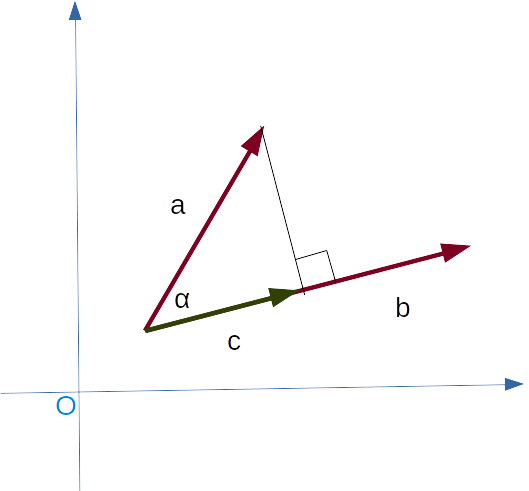
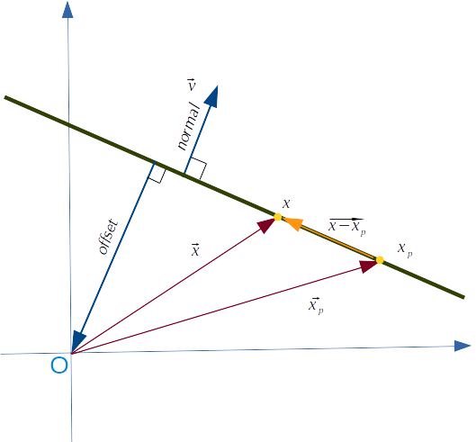
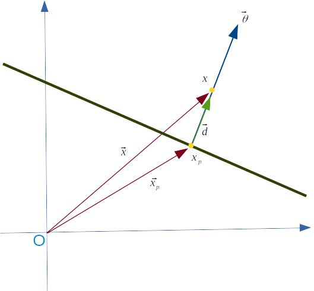

$\newcommand\array[1]{\begin{bmatrix}#1\end{bmatrix}}$ [[MITx 6.86x Notes Index]](https://github.com/sylvaticus/MITx_6.86x)

#  Unit 00 - Course Overview, Homework 0, Project 0

## Recitation 1 - Brief Review of Vectors, Planes, and Optimization

### Points and Vectors

**Norm of a vector**

Norm: Answer the question how big is a vector

- $\|X\|_l \equiv l-NORM := (\sum_{i=1}^{size(X)} x_i^l)^{(1/l)}$
- Julia: `norm(x)`
- NumPy: `numpy.linalg.norm(x)`

If l is not specified, it is assumed to be 2, i.e. the Euclidian distance. It is also known as "length", "2-norm", "l2 norm", ...

**Dot product of vector**

Aka "scalar product" or "inner product".

It has a relationship on how vectors are arranged relative to each other

- Algebraic definition: $x \cdot y \equiv x' y := \sum_{i=1}^n 2x_i * y_i$
- Geometric definition: $x \cdot y := \|x\| * \|y\| * cos(\theta)$ (where $\theta$ is the angle between the two vectors and $\|x\|$ is the 2-norm)
- Julia: `dot(x,y)`
- Numpy: `np.dot(x,y)`

Note that using the two definitions and the `arccos`, the inverse function for the cosine, you can retrieve the angle between two functions as `angle_x_y = arccos(dot(x,y)/(norm(x)*norm(y)))`.

- Julia: `angle_x_y = acos(dot(x,y)/(norm(x)*norm(y)))`


**Geometric interpretation of a vector**

Geometrically, the elements of a vector can be seen as the coordinates of the position of arrival _compared to the position of departing_. They represent hence the _shift_ from the departing point.

For example the vector [-2,0] could refer to the vector from the point (4,2) to the point (2,2) but could also represent the vector going from (6,4) to (4,4).

Vectors whose starting point is the origin are called _position vectors_ and they define the coordinates in the n-space of the points where they arrive to.


### Vector projections

Let's be _a_ and _b_ two (not necessary unit) vectors.
We want to compute the vector _c_ being the projection of _a_ on _b_ and its l-2 norm (or length):



Let's start from the length. We know from a well-known trigonometric equation that

$\|c\| = \|a\| * cos(\alpha)$, where $\alpha$ is the angle between the two vectors _a_ and _b_:

But we also know that the dot product $a \cdot b$ is equal to $\|a\| * \|b\| * cos(\alpha)$.

By substitution we find that $\|c\| = \frac{a \cdot b}{\|b\|}$. This quantity is also called the _component_ of _a_ in the direction of _b_.

To find the vector _c_ we now simply multiply $\|c\|$ by the unit vector in the direction of _b_, $\frac{b}{\|b\|}$, obtaining $c = \frac{a \cdot b}{\|b\|^2} * b$.

If _b_ is already a unit vector, the above equations reduce to:

$\|c\| = a \cdot b$ and $c = (a \cdot b) * b$

In Julia:

```
using LinearAlgebra
a = [4,1]
b = [2,3]
normC = dot(a,b)/norm(b)
c = (dot(a,b)/norm(b)^2) * b
```

In Python:

```
import numpy as np
a = np.array([4,1])
b = np.array([2,3])
normC = np.dot(a,b)/np.linalg.norm(b)
c = (np.dot(a,b)/np.linalg.norm(b)**2) * b
```


### Planes

An (hyper)plane in n dimensions is any n−1 dimensional subspace defined by a linear relation. For example, in 3 dimensions, hyperplanes span 2 dimensions (and they are just called "planes") and can be defined by the vector formed by the coefficients {A,B,C,D} in the equation $Ax + By + Cz + D = 0$. Note that while the plane is unique, the vector defining it is not: in relation to the A-D coefficients, the equation is homogeneous, i.e. if we multiply all the A-D coefficients by the same number, the equation remains valid.

As hyperplanes separate the space into two sides, we can use (hyper)planes to set boundaries in classification problems, i.e. to discriminate all points on one side of the plane vs all the point on the other side.

Besides to this analytical definition, a plane can be uniquely identified also in a geometrical way starting from a point $x_p$ on the plane and a vector $\vec{v}$ normal to the plane (not necessarily departing from the point or even from the plane):. Let's define:

- *Normal* of a plane: any n-dimensional vector perpendicular to the plane.
- *Offset of the plane with the origin*: the distance of the plan with the origin, that is the specific normal between the origin and the plane




Given a point $x_p$ known to sit on the plane and $\vec{x_p}$ its positional vector, a generic point $x$ and corresponding positional vector $\vec{x}$, the point $x$ is part of the plane if and only if ("iff") the vector connecting the two points, that is $\vec{x-x_p}$, lies on the plane. In turn this is true iff such vector is orthogonal to the normal of the plane $\vec{v}$, that we can check using the dot product.

To sum up, we can define the plane as the set of all points x $x$ such that $(\vec{x-x_p}) \cdot \vec{v} = 0$.

As from the coefficients A-D in the equation, while $x_p$ and $⃗\vec{v}$ unambiguously identify the plane, the converse is not true: any plane has indeed infinite points and normal vectors.

For example, let's define a plane in two dimensions passing by the point $x_p = (3,1)$ and with norm $\vec{v} = (2,2)$, and let's check if point $a = (1,3)$ is on the plane.
Using the above equation we find $(\vec{a} - \vec{x_p}) \cdot \vec{v}  = \left(\array{1\\3} - \array{3\\1} \right) \cdot \array{2\\2} = 0$, _a_ is part of the plane.

Let's consider instead the point b = (1,4). As $(\vec{b} - \vec{x_p}) \cdot \vec{v}  = \left(\array{1\\4} - \array{3\\1} \right) \cdot \array{2\\2} = 2$, _b_ is not part of the plane.

Starting from the information on the point and the normal we can retrieve the algebraic equation of the plane rewriting the equation $(\vec{x-x_p}) \cdot \vec{v} =0$ as $\vec{x} \cdot \vec{v} - \vec{x_p} \cdot \vec{v} =0$: the first dot product gives us the polynomial terms in the n-dimensions (often named $\theta$), the last (negatively signed) term gives the associated offset (often named $\theta_0$). Seen from the other side, this also means that the coefficients of the dimensions of the algebraic equation represent the normal of the plane. We can hence define our plane with just the normal and the corresponding offset (always a scalar).

Note that when $\theta$ is a unit vector (a vector whose 2-norm is equal to 1) the offset $\theta_0$ is equal to the offset of the plane with the origin.

Using the above example ($x_p = [3,1]$, $\vec{v} = [2,2]$), we find that the algebraic equation of the plane is $2x_1+2x_2-(3*2 + 1*2)=0$, or, equivalently, $\frac{x_1}{\sqrt{2}}+\frac{x_2}{\sqrt{2}}-\frac{4}{\sqrt{2}}=0$.

**Distance of a point to a plane**

Given a plan defined by its norm $\theta$ and the relative offset $\theta_0$, which is the distance of a generic point $x$ from such plane ?
Let's start by calling $\vec{f}$ the vector between any point on the plan $x_p$ and the point $x$, that is $\vec{f} = \vec{x} - \vec{x_p}$. The distance $\|\vec{d}\|$ of the point with the plane is then  $\|\vec{d}\| = \|\vec{f}\| * cos(\alpha)$, where $\alpha$ is the angle between the vector $\vec{f}$ and $\vec{d}$.


But we know also that $\vec{f} \cdot \vec{\theta} = \|\vec{f}\| * \|\vec{\theta}\| * cos(\alpha)$ from the definition of the dot product.

By substitution, we find that $\|\vec{d}\| = \|\vec{f}\| * \frac{\vec{f} \cdot \vec{\theta}}{\|\vec{f}\| * \|\vec{\theta}\|} = \frac{\vec{f} \cdot \vec{\theta}}{\|\vec{\theta}\|}$ (we could have arrived to the same conclusion by considering that $\|\vec{d}\|$ is the component of $\vec{f}$ in direction of $\vec{\theta}$).


By expanding $\vec{f}$ we find that $\|\vec{d}\| = \frac{(\vec{x} - \vec{x_p}) \cdot \vec{\theta}}{\|\vec{\theta}\|} = \frac{\vec{x} \cdot \vec{\theta} + \theta_0}{\|\vec{\theta}\|}$

The distance is positive when $x$ is on the same side of the plane as $\vec{\theta}$ points and negative when $x$ is on the opposite side.

For example the distance between the point $x = (6,2)$ and the plane as define earlier with $\theta = (1,1)$ and $\theta_0 = -4$ is $\frac{\vec{x} \cdot \vec{\theta} + \theta_0}{\|\vec{\theta}\|} = \frac{\array{6\\2} \cdot \array{1\\1} -4}{\|\array{1\\1}\|} = \frac{8-4}{\sqrt{2}} = 2*\sqrt{2}$

**Projection of a point on a plane**

We can easily find the projection of a point on a plane by summing to the positional vector of the point, the vector of the distance from the point to the plan, in turn obtained multiplying the distance (as found earlier) by the _negative_ of the unit vector of the normal to the plane.



Algebraically: $\vec{x_p} = \vec{x} - \frac{\vec{x} \cdot \vec{\theta} + \theta_0}{\|\vec{\theta}\|} * \frac{\vec{\theta}}{\| \vec{\theta} \|} = \vec{x} - \vec{\theta}* \frac{\vec{x} \cdot \vec{\theta} + \theta_0}{\|\vec{\theta}\|^2}$

For the example before, the point $x_p$ is given by $\array{6\\2}-\array{1\\1} * \frac{\array{6\\2} \cdot \array{1\\1} -4 }{2} = \array{6\\2} - \array{2\\2} = \array{4\\0}$

On this subject see also:
- https://www.khanacademy.org/math/linear-algebra/vectors-and-spaces/dot-cross-products/v/defining-a-plane-in-r3-with-a-point-and-normal-vector
- https://www.khanacademy.org/math/linear-algebra/vectors-and-spaces/dot-cross-products/v/point-distance-to-plane


## Loss Function, Gradient Descent, and Chain Rule

**Loss Function**

_This argument in details: segments 3.4 (binary linear classification), 5.4 (Linear regression)_

The loss function, aka the _cost function_ or the _race function_, is some way for us to value how far is our model from the data that we have.

We first define an "error" or "Loss". For example in Linear Regression the "error" is the Euclidean distance between the predicted and the observed value:

$L(x,y;\Theta) = \sum_{i=1}^n |\hat y-y| = \sum_{i=1}^n |\theta_1 x +\theta_2 -y|$

The objective is to minimise the loss function by changing the parameter theta. How?

**Gradient Descent**

_This argument in details: segments 4.4 (gradient descent in binary linear classification), 4.5 (stochastic gradient descent) and 5.5 (SGD in linear regression)_

The most common iterative algorithm to find the minimum of a function is the gradient descent.

We compute the loss function with a set of initial parameter(s), we compute the gradient of the function (the derivative concerning the various parameters), and we move our parameter(s) of a small delta against the direction of the gradient at each step:

$\hat \theta_{s+1} = \hat \theta_{s+1} - \gamma \nabla L(x,y;\theta)$

The $\gamma$ parameter is known as the _learning rate_.

- too small learning rate: we may converge very slowly or end up trapped in small local minima;
- too high learning rate: we may diverge instead of converge to the minimum


**Chain rule**

How to compute the gradient for complex functions.

$\frac{\partial y}{\partial x} = \frac{\partial y}{\partial z} * \frac{\partial z}{\partial x}$


e.g. $\hat y = \frac{1}{1+e^{-(\theta_1 x + \theta_2)}} = (1+e^{-(\theta_1 x + \theta_2)})^{-1}$,
$\frac{\partial \hat y}{\partial \theta_1} = - \frac{1}{(1+e^{-(\theta_1 x + \theta_2)})^2}*e^{-(\theta_1 x + \theta_2)}*-x$

For computing derivatives one can use SymPy, a library for symbolic computation. In this case the derivative can be computed with the following script:

```
from sympy import *
x, p1, p2 = symbols('x p1 p2')
y = 1/(1+exp( - (p1*x + p2)))
dy_dp1 = diff(y,p1)
print(dy_dp1)
```

It may be useful to recognise the chain rule as an application of the _chain map_, that is tracking all the effect from one variable to the other:


## Geometric progressions and series

**Geometric progressions** are sequence of numbers where each term after the first is found by multiplying the previous one by a fixed, non-zero number called the _common ratio_.

It results that geometric series can be wrote as $a, ar, ar^2, ar^3, ar^4,...$ where $r$ is the common ratio and the first value $a$ is called the _scale factor_.

**Geometric series** are the sum of the values in a geometric progression.

Closed formula exist for both finite geometric series and, provided $|r| < 1$, for infinite ones:

- $\sum_{k=m}^n ar^k = \frac{a(r^m-r^{n+1}}{1-r}$ with $r \neq 1$ and $m < n$
- $\sum_{k=m}^∞ ar^k = \frac{ar^m}{1-r}$ with $|r| < 1$ and $m < n$.

Where m is the first element of the series that you want to consider for the summation. Typically $m=0$, i.e. the summation considers the whole series from the scale factor onward.

For many more details on geometric progressions and series consult the relative excellent [Wikipedia entry](https://en.wikipedia.org/wiki/Geometric_progression).

[[MITx 6.86x Notes Index]](https://github.com/sylvaticus/MITx_6.86x)
